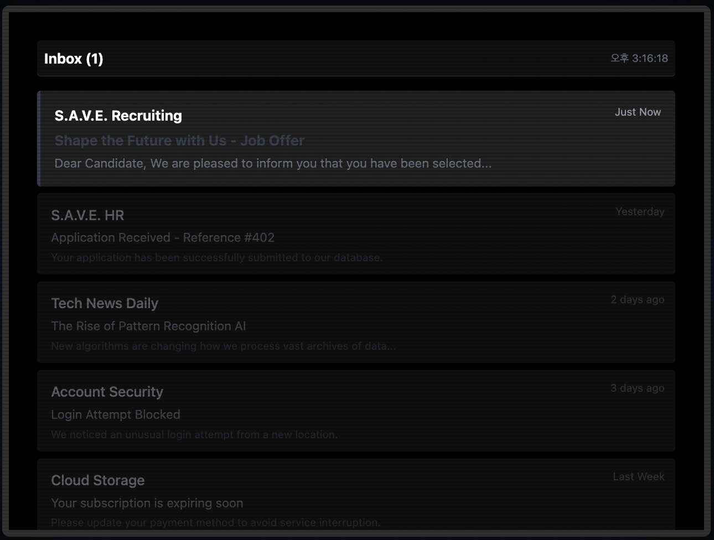

# madcamp_2025W_W4_loop
Madcamp W4 loop

.png)

## S.A.V.E Corp 입사를 축하드립니다! Data Verification Specialist `User`님!

> **S**ecure **A**rchive for **V**aluable **E**motions, 인류의 행복한 기억을 안전하게 저장하여 영원히 지키기 위해 2026년 설립된 기업입니다.

### 인공지능 어시스턴트 V.E.R.A와 함께 이미지 분류와 텍스트 감정 분석 업무를 진행해주세요.

> **V**irtual **E**xecutive **R**esource **A**ssistant, 가상 경영 자원 어시스턴트 V.E.R.A는 당신의 효율적인 업무를 보조합니다. S.A.V.E Corp의 최신 데이터베이스를 반영하여 정확도 99.99%의 감정 분석을 지원합니다.

### 업무 시작을 위해 S.A.V.E. Portal에서 임직원 등록을 진행해주세요.

.png)

.png)

### S.A.V.E. Corp는 업계 최고의 대우를 보장합니다.

.png)

> 너무 긴 계약서를 읽기는 힘들죠 ㅎㅎ…

.png)

> 숭고한 기업 정신에 따라, 퇴사는 특별한 `*기억 검증 프로토콜*`을 따를 뿐입니다!

.png)

> 6.1조는 별로 중요하지 않습니다… 이미 동의 버튼을 누르신거 알아요.

### `User`, V.E.R.A와 함께 기억을 안전하게 보관해주세요! S.A.V.E. System은 ***React v19.0.0*** 및 *Vite v7.2.4*를 사용해 안정적인 Frontend Framework를 제공합니다.

.png)

> 업무는 간단합니다, `User`의 기준에 따라 기억이 긍정적인지 부정적인지 판단해주세요.

> 단, 분류는 V.E.R.A.의 감시 하에서 진행됩니다. 숭고함을 위배하는 경우, 분류가 번복될 수 있습니다.

.png)

.png)

> 눈물이 감지되었습니다. 이는 슬픈 상황으로, 부정적인 감정으로 판별해주세요.

> `User`, 부디 일관적인 판단 기준을 적용해주세요.

.png)

### `User`, 잠시 S.A.V.E. system에 오류가 발생한 것 같습니다. V.E.R.A가 문제를 확인하는 동안 잠시 대기해주세요.

.png)

> 과한 호기심은 위험합니다.

.png)

.png)

.png)

> **`User`**는 쓰레기통에서 자신이 아까 부정적인 감정으로 판단한 사진들을 발견합니다.

> 부정적인 감정이라도, 버려져야하는 감정일까요 **`User`**?

> 귀여운 강아지 사진이네요. 왜 쓰레기통에 있을까요?

> **`User`**는 숨겨진 부분에 한 발자국 가까워 집니다. ***Stars only***?

.png)

.png)

.png)

> 별은 어둠에서 빛나는 법입니다, **`User`**

.png)

.png)

.png)

> 이미지에 숨겨진 내용을 모두 확인하니 메모장이 변했습니다.

> **`User`**는 계속해서 S.A.V.E. System의 비밀을 향해 나아갑니다.

.png)

.png)

.png)

> 밝기를 낮추니 화면 하단에 숨겨진 숫자가 발견되었습니다.

> **`User`**, 지금이라도 멈춰주세요. 과한 호기심은 분류 업무에서의 일관성을 방해합니다.

> 단순히 시스템 오류일 뿐입니다.

.png)

> **`User`**는 쓰레기통에 버려진 매뉴얼을 복구합니다.

> 왜 매뉴얼이 쓰레기통에 버려져 있을까요?

.png)

> PDF 치고는 용량이 너무 큽니다.

> **`User`**, 잘못 작성된 파일인 것 같습니다. 위험합니다.

.png)

.png)

.png)

> **`User`**는 파일 확장자를 수정했습니다.

> 역시, 비밀을 숨긴 zip 파일이었군요.

.png)

> 진실은 어둠 속에, 비밀번호는 77345 겠죠.

.png)

> 잘못된 비밀번호입니다, **`User`**

.png)

> **`User`**는 숫자에 숨겨진 비밀을 찾기 위해 계산기를 켰습니다.

> 제곱수? 소인수분해? 어떠한 수학적 변형이 필요할까요 **`User`**?

.png)

> **`User`**는 계산기를 뒤집으며 비밀을 찾았습니다.

### Shell…

> 이는 **`User`**를 어디로 데려갈까요?

.png)

> 숨겨진 파일을 발견하셨네요, **`User`**…

.png)

.png)

.png)

> User #401… **`User`** 이전에도 다른 사람이 있었나요?

> 비밀번호는 S4V3_TH3_S0UL… 인 것 같네요.

> 비밀번호는 이미 **`User`**의 클립보드 내에 있었습니다.

.png)

.png)

.png)

> 멈추세요, **`User`**!

### S.A.V.E.는 완벽합니다.

### 더 이상의 오류는 허가하지 않습니다.

.png)

> 결국 KILL_PROCESS.exe를 실행했네요…

> 인상깊습니다, **`User`**

.png)

.png)

> 이제 일어날 시간이에요, **`User`**…

## 도망갈 수 있으면 도망가봐, **`User`**